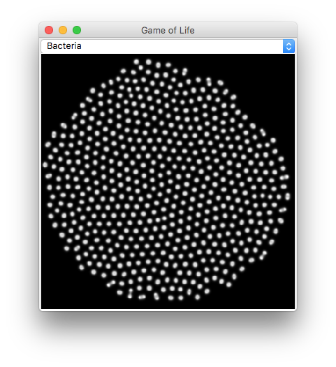
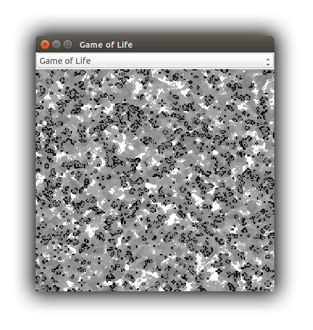
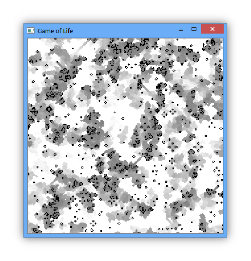

## Game of Life - [`life.py`](life.py)

Gray-Scott reaction diffusion system and a simple cellular automaton with a fancy history fading visualization bundled
in one compact application.

__How to play__: Select a game from the combo box and watch.

__Details__: [Game of Life](https://en.wikipedia.org/wiki/Conway%27s_Game_of_Life),
             [Reaction Diffusion System](https://en.wikipedia.org/wiki/Reaction%E2%80%93diffusion_system)

