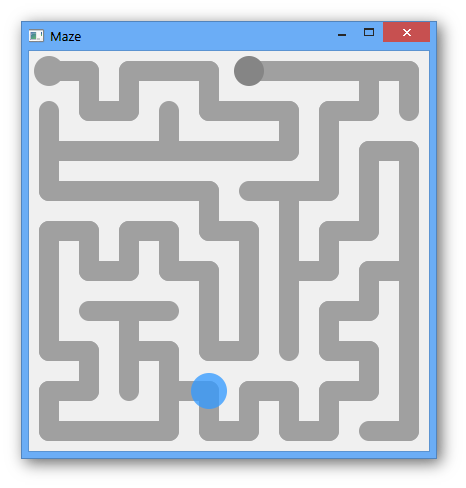

## Maze - [`maze.py`](maze.py)

Maze typically found in a children's magazine generated by a stochastic DFS algorithm. This guarantees that the end of
the maze is always hard to get to. Also check out the fancy ball animations :)

__How to play__: Get the ball to the end of the maze!

__Details__: [Maze](https://en.wikipedia.org/wiki/Maze),
             [Depth First Search](https://en.wikipedia.org/wiki/Depth-first_search)

