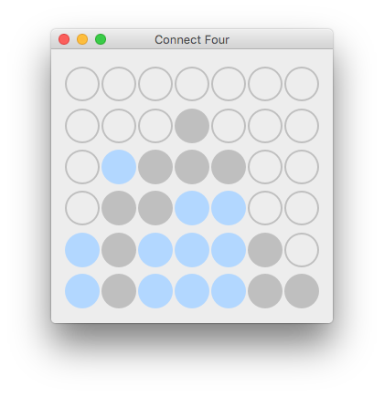
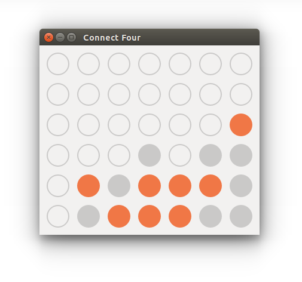
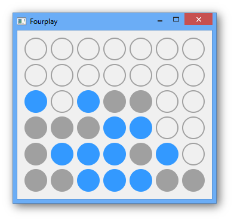
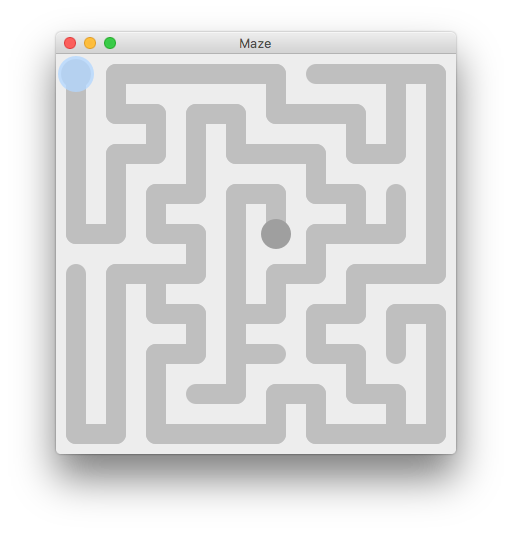
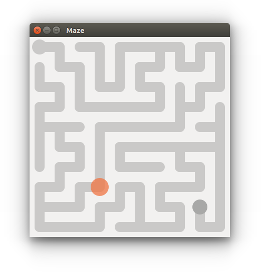

# Games and AIs :)

## Sheriff Chase - [`sheriff/`](sheriff/)
Implementation of value iteration, policy iteration and Q learning algorithms that search for the optimal
policy. The game is a simple deterministic implementation of an OpenAI gym environment extended to Markov
Decision Process.

## Game of Life - [`life/`](life/)
Gray-Scott reaction diffusion system and a simple cellular automaton with a fancy history fading visualization bundled
in one compact application.

## Tetris - [`tetris/`](tetris/)
Yet another clone of the greatest game of all time. Peppered up with fancy tetrimino bouncing animation.

## Fourplay - `fourplay.py`
Logical game for two with a quite-hard (but not impossible) to beat AI. The algorithm uses a version of
[depth-first-search](https://en.wikipedia.org/wiki/Depth-first_search) which does branch pruning of obviously wrong choices for speed-up. The AI looks 8 moves ahead.

__How to play__: Form a straight line out of four dots!

__Details__: [Wikipedia](https://en.wikipedia.org/wiki/Connect_Four)

  

## Maze - `maze.py`
Maze from a children magazine generated by a stochastic [depth-first-search](https://en.wikipedia.org/wiki/Depth-first_search)
algorithm. This guarantees that the end of the maze is always hard to get to. Also check out the fancy ball animations :)

__How to play__: Get the ball to the end of the maze!

__Details__: [Wikipedia](https://en.wikipedia.org/wiki/Maze)

  

## Minesweeper - `minesweeper.py`
Clone of the only good software produced by a certain Seattle company...

__How to play__: Just don't blow up!

__Details__: [Wikipedia](https://en.wikipedia.org/wiki/Microsoft_Minesweeper)

  

## Tic-Tac-Toe - `tictactoe.py`
Oldie but goodie 3 by 3 noughts against crosses. Peppered up with a simple but never-losing AI. Good luck trying to
beat it!

__How to play__: Get three ◯s or ☓s in a row!

__Details__: [Wikipedia](https://en.wikipedia.org/wiki/Tic-tac-toe)

  

## Requirements
- [Python 3](https://www.python.org/downloads/)
- [PyQt5](https://riverbankcomputing.com/software/pyqt/download5) (May also work with [PySide](http://www.pyside.org/), but wasn't tested)
- [Numpy](http://www.numpy.org) (Only for `life.py`)

This work is licensed under the [MIT License](https://opensource.org/licenses/MIT) © 2017.
