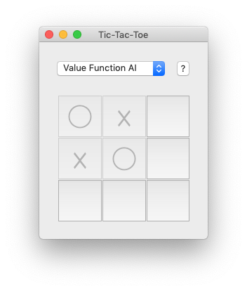
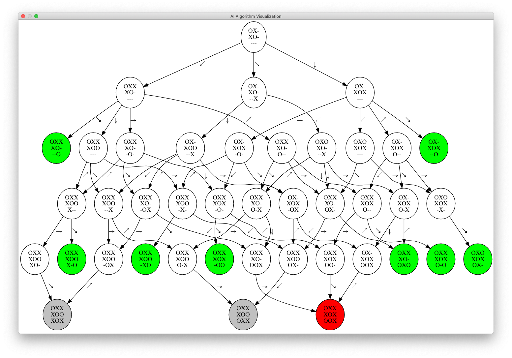

## Tic-Tac-Toe - [`tictactoe.py`](tictactoe.py)

Oldie but goodie 3 by 3 noughts against crosses with 4 different built-in AIs. Good luck trying to beat them ;)
Check out the `?` button the visualizes the current game graph as seen by the AI algorithm.
 
Implementation notes and details about the AI algoritms can be found in the [`readme.pdf`](readme.pdf) file.

__How to play__: Get three ◯s or ☓s in a row!

__Details__: [Tic-Tac-Toe](https://en.wikipedia.org/wiki/Tic-tac-toe),
             [Minimax](https://en.wikipedia.org/wiki/Minimax),
             [Monte Carlo Tree Search](https://en.wikipedia.org/wiki/Monte_Carlo_tree_search),
             [Temporal Difference Learning](https://en.wikipedia.org/wiki/Temporal_difference_learning)

__Requirements__: [PySide2](https://wiki.qt.io/Qt_for_Python),
                  [pygraphviz](https://pygraphviz.github.io),
                  [numpy](http://numpy.org)

